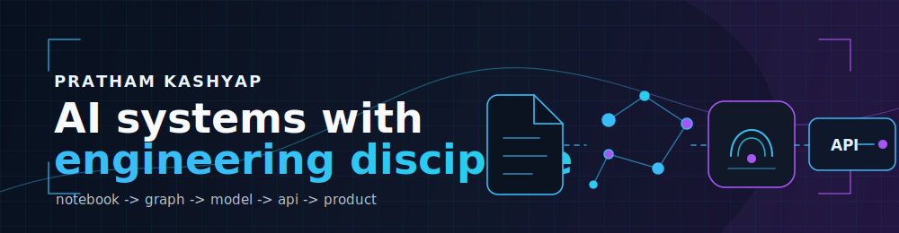

 

<table>
<tr>
<td align="center"><strong>5+</strong> featured projects</td>
<td align="center"><strong>4</strong> research tracks</td>
<td align="center"><strong>AthenaeumAI</strong> currently building</td>
<td align="center"><strong>CV + APIs</strong> current focus</td>
<td align="center"><strong>VIT Bhopal</strong> CSE AI/ML</td>
</tr>
</table>

 

I build complete AI systems: data pipelines, models, APIs, and interfaces that hold up outside the notebook.

## About

I'm a Computer Science undergraduate specializing in AI & ML at VIT Bhopal. My work sits at the intersection of applied AI, computer vision, backend engineering, and research-oriented development.

I like building systems where an idea moves from a dataset or notebook into a usable product: engineered features, evaluated models, reliable APIs, persistent storage, and interfaces people can actually use.

## Current Build Log

| Focus | What I am working on |
| --- | --- |
| **AthenaeumAI** | AI-powered study platform that turns source material into quizzes and adaptive learning paths. |
| **Backend systems** | API design, system design, databases, and distributed systems fundamentals. |
| **Computer vision** | Shelf monitoring, plant disease detection, multimodal interfaces, and real-world robustness. |
| **Research** | Geospatial ML, neuro-fuzzy ranking systems, and practical evaluation methods. |

## Tech Stack

**Languages**  

**Backend & Web**  

**AI / ML**  

**Data & Infra**  

## Featured Projects

<table>
<tr>
<td width="72" valign="top"> </td>
<td valign="top">

### [AthenaeumAI](https://github.com/prathamkashyap/AthenaeumAI)

**AI learning system that turns notes into quizzes and adaptive study sessions.**

Built around chunk-based document processing, semantic filtering, Groq-backed generation, MongoDB persistence, and a React dashboard.

`React` `Node.js` `MongoDB` `Groq API`

</td>
</tr>
</table>

<table>
<tr>
<td width="72" valign="top"> </td>
<td valign="top">

### [CiviQ - Smart Civic Issue Register & Tracker](https://github.com/prathamkashyap/CiviQ)

**Geospatial ML platform for prioritizing urban civic complaints.**

Combines domain-knowledge labels, KNN density features, DBSCAN hotspot detection, and XGBoost classification. Validated on real NYC 311 records with 95.7% accuracy.

`React` `Firebase` `Python` `XGBoost` `Scikit-learn`

</td>
</tr>
</table>

<table>
<tr>
<td width="72" valign="top"> </td>
<td valign="top">

### [Smart Retail Store Assistant](https://github.com/prathamkashyap/Smart-Retail-Store-Assistant)

**Single-camera retail shelf monitor without custom training.**

YOLOv8 detection plus velocity-predicted centroid tracking for shelf-zone monitoring, dwell-time estimation, product-removal detection, and anomaly alerts.

`Python` `OpenCV` `YOLOv8` `NumPy` `SciPy`

</td>
</tr>
</table>

<table>
<tr>
<td width="72" valign="top"> </td>
<td valign="top">

### [Multimodal AI Assistant](https://github.com/prathamkashyap/Multimodal-AI-Assistant)

**Face-gated voice assistant that only listens when it should.**

Uses OpenCV Haar-cascade face gating, Whisper transcription, and a rule-based intent classifier across five categories with graceful empty-input handling.

`Python` `OpenCV` `Whisper` `MediaPipe` `Tkinter`

</td>
</tr>
</table>

<table>
<tr>
<td width="72" valign="top"> </td>
<td valign="top">

### [AgriTech - Plant Disease Detection](https://github.com/prathamkashyap/AgriTech-Plant-Disease-Detection)

**Computer vision pipeline for wheat, tomato, and cotton disease detection.**

Combines Segment Anything Model for leaf/stem segmentation with YOLOv11 disease detection trained on Plant Village data.

`YOLOv11` `SAM` `TensorFlow Lite`

</td>
</tr>
</table>

## Research Notes

| Work | Signal |
| --- | --- |
| **GA-ET-IVCFS-ANFIS** | Neuro-fuzzy product-ranking framework under uncertainty; best model reached R2 = 0.98. |
| **Civic complaint prioritization** | Hybrid synthetic + NYC 311 evaluation for geospatial civic issue triage. |
| **Multimodal AI Assistant** | Solo-authored IEEE-style work on real-time interaction through vision and speech. |
| **Parkinson's biomarker mining** | Voice-feature mining pipeline; best SVM model reached F1 0.935 and ROC-AUC 0.945. |

## GitHub Analytics

 

 

## Notebook Margins

<table>
<tr>
<td width="56"></td>
<td><strong>Currently reading</strong> <em>Designing Data-Intensive Applications</em></td>
</tr>
<tr>
<td width="56"></td>
<td><strong>Current rabbit hole</strong> Model Context Protocol and production AI tooling</td>
</tr>
<tr>
<td width="56"></td>
<td><strong>Engineering bias</strong> Complete AI systems over isolated model demos</td>
</tr>
</table>

## Competitive Programming & Profiles

## 🏅 Community & Open Source

**Building Software**  
**That Matters**

