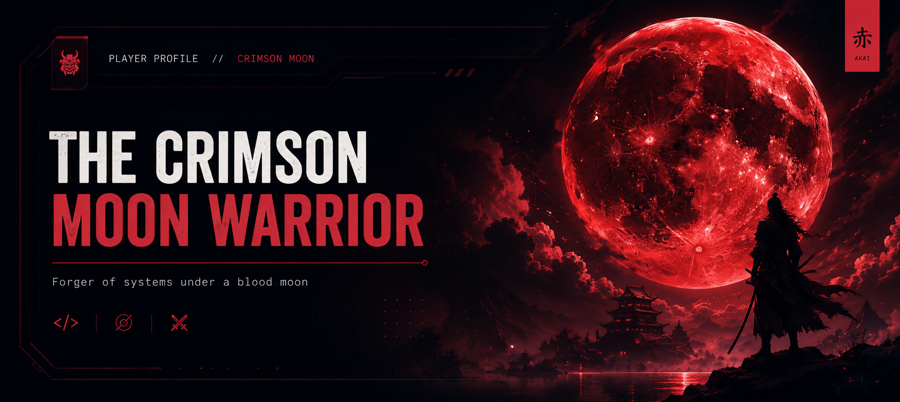
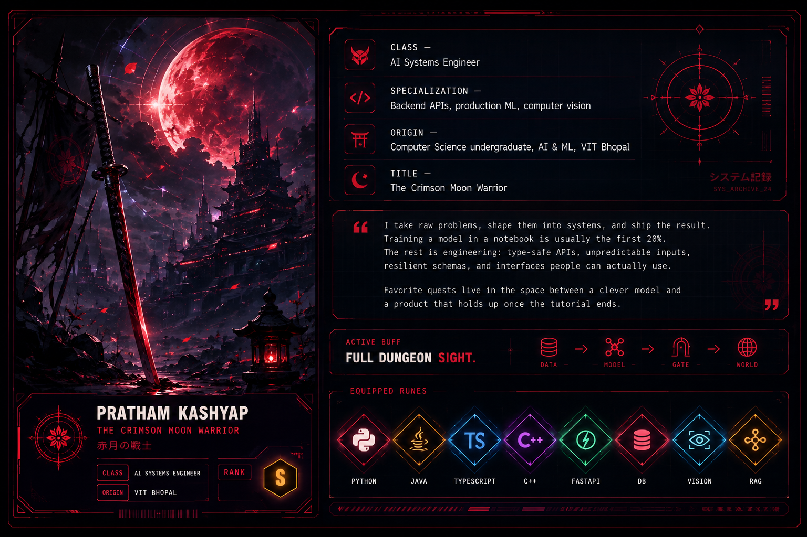

`Class: The Systems Forger` &nbsp;·&nbsp; `Guild: VIT Bhopal — AI & ML` &nbsp;·&nbsp; `8 Quests Cleared` &nbsp;·&nbsp; `Status: Open for New Quests`

  <a href="https://prathamkashyap.vercel.app/">Portfolio</a>
  &nbsp;·&nbsp;
  <a href="https://github.com/prathamkashyap">GitHub</a>
  &nbsp;·&nbsp;
  <a href="https://linkedin.com/in/prathamkashyap5">LinkedIn</a>
  &nbsp;·&nbsp;
  <a href="mailto:pkmail2005@gmail.com">Email</a>

- **AI Systems Lab** — `MAIN QUEST · S-RANK`  
  Inference gateway with SingleFlight deduplication, circuit breakers, and hybrid BM25 + dense retrieval fused with Reciprocal Rank Fusion.
- **Libris** — `SIDE QUEST · A-RANK`  
  Enterprise-style library backend on Spring Boot: layered architecture, Google OAuth2/OIDC SSO, dual-theme frontend, CI-enforced coverage.
- **AthenaeumAI** — `SIDE QUEST · B-RANK`  
  RAG-grounded study platform that turns PDFs into quizzes and flashcards, with SM-2 spaced repetition driving the review queue.
- **Iron path** — `SYSTEMS DESIGN`  
  REST contracts, caching, indexing, and write-heavy consistency.
- **Sight & voice** — `FIELD OPERATIONS`  
  YOLOv8/11, SAM, OpenCV, Whisper — realtime inference with graceful degradation.

🟨 **LEGENDARY — AI Systems**  
`Python` `FastAPI` `Redis-style caching` `RRF retrieval` `Prometheus`

🟪 **EPIC — Backend Forge**  
`Java 21` `Spring Boot` `Node.js` `Express` `Flask`

🟦 **RARE — Vision Core**  
`PyTorch` `TensorFlow` `OpenCV` `YOLOv8/11` `SAM` `Whisper`

🟦 **RARE — Data Sense**  
`PostgreSQL` `MySQL` `MongoDB` `Firebase` `Docker` `Linux` `Git`

**Languages** — `C++` `Python` `Java` `JavaScript` `TypeScript` `SQL`  
**Web** — `React` `Vite` `FastAPI` `Spring Boot` `Node.js`  
**Infrastructure** — `Docker` `Git` `Linux` `GitHub Actions`

###  &nbsp; [AI Systems Lab](https://github.com/prathamkashyap/ai-systems-lab)
`MAIN QUEST` · `LEGENDARY`

*An inference gateway forged to survive the live server, not just the tutorial zone.*

An engineering reference for AI infrastructure, built as a gateway rather than a notebook. TTL+LRU caching, SingleFlight deduplication, micro-batching, circuit breaking, and failover across Anthropic, OpenAI-compatible backends (Ollama, vLLM, DeepSeek, Groq), plus a deterministic MockProvider. Hybrid BM25 + dense-vector retrieval with Reciprocal Rank Fusion, a RAG evaluation suite, an interactive playground, Prometheus metrics, and 40 tests.

Benchmarked: 200 concurrent duplicate prompts drop from 297.7ms to 45.5ms wall time via SingleFlight — a 99.5% deduplication rate.

`Python` `FastAPI` `Caching` `RRF` `Prometheus` · [Repository](https://github.com/prathamkashyap/ai-systems-lab)

###  &nbsp; [Libris](https://github.com/prathamkashyap/libris)
`SIDE QUEST` · `EPIC`

*A library guild's records vault, armored with the same layers a real fortress needs.*

Enterprise-style library backend, built the way production systems are built. Spring Boot 3.5 layered REST (Controller → Service → Repository), MySQL, Flyway, Ember Dark / Verdigris Light frontend. BCrypt sessions plus opt-in Google OAuth2/OIDC, Admin / Librarian / Student RBAC, CSRF protection, JSON logging, Swagger/OpenAPI. 20 tests across 4 classes, JaCoCo ≥70%.

`Java 21` `Spring Boot` `MySQL` `Flyway` `Docker` · [Repository](https://github.com/prathamkashyap/libris) · [Live](https://libris-lms.up.railway.app)

###  &nbsp; [AthenaeumAI](https://github.com/prathamkashyap/AthenaeumAI)
`SIDE QUEST` · `EPIC`

*Turns a graveyard of forgotten PDFs into a study companion that remembers what you keep forgetting.*

RAG-grounded study system: chunked PDF ingestion, semantic retrieval, Groq Llama 3.3 70B generation, SM-2 spaced repetition, exponential-decay retention. Redis/BullMQ jobs with typed enqueue errors and retry-safe validation. 118 unit tests, 21 integration tests, Playwright E2E, GitHub Actions CI.

`React` `Node.js` `MongoDB` `Redis` `Groq` · [Repository](https://github.com/prathamkashyap/AthenaeumAI)

###  &nbsp; [AI Smart Retail & Customer Intelligence](https://github.com/prathamkashyap/AI-Smart-Retail-Customer-Intelligence-Platform)
`FIELD QUEST` · `RARE`

*One watchtower over the whole shop floor — faces, shelves, reviews, and a chatbot that actually answers back.*

End-to-end retail intelligence behind one gateway: OpenCV face encodings (never raw images), MobileNetV2 product classification, TF-IDF + logistic regression review sentiment, hybrid rule + ML-intent chatbot. React + Vite dashboard, webcam capture, Chart.js analytics.

`OpenCV` `React` · [Repository](https://github.com/prathamkashyap/AI-Smart-Retail-Customer-Intelligence-Platform) · [Live](https://ai-smart-retail-customer-intelligence.vercel.app/)

###  &nbsp; [CiviQ](https://github.com/prathamkashyap/CiviQ)
`FIELD QUEST` · `RARE`

*Reads a city's complaints like a battle map, so the right crew gets sent to the right street.*

Geospatial ML for civic-complaint triage. KNN spatial-density features, DBSCAN hotspots, XGBoost classifier, 5-fold CV on 1,600 synthetic + 5,469 NYC 311 records — **95.7% accuracy**. Spatial-density features alone lifted Decision Tree accuracy by 12.9 points. React/Firebase reporting with Leaflet hotspot maps.

`React` `Firebase` `XGBoost` · [Repository](https://github.com/prathamkashyap/CiviQ)

###  &nbsp; [Multimodal AI Assistant](https://github.com/prathamkashyap/Multimodal-AI-Assistant)
`FIELD QUEST`

*An assistant that stays asleep until it sees a face — then listens.*

Face-gated voice assistant that triggers only on visual presence. OpenCV Haar-cascade gating, Whisper transcription, deterministic 5-category intent router with fallbacks.

`Python` `OpenCV` `Whisper` · [Repository](https://github.com/prathamkashyap/Multimodal-AI-Assistant)

###  &nbsp; [Voice Command Shopping Assistant](https://github.com/prathamkashyap/voice-command-shopping-assistant)
`FIELD QUEST`

*A shopping list summoned by voice alone, in four languages, with no server standing behind it.*

Browser-native voice shopping list — no backend, no login. Web Speech API parser for add / remove / quantity / brand / price, with history and seasonal suggestions. English, Hindi, Telugu, and Tamil, plus text fallback.

`JavaScript` `Web Speech API` · [Repository](https://github.com/prathamkashyap/voice-command-shopping-assistant)

###  &nbsp; [AgriTech — Plant Disease Detection](https://github.com/prathamkashyap/AgriTech-Plant-Disease-Detection)
`FIELD QUEST`

*Reads a leaf like a diagnosis chart — one model finds it, the other names what's wrong.*

SAM isolates leaf and stem; custom YOLOv11 detectors diagnose wheat, tomato, and cotton disease.

`YOLOv11` `SAM` `TensorFlow Lite` · [Repository](https://github.com/prathamkashyap/AgriTech-Plant-Disease-Detection)

- **GA-ET-IVCFS-ANFIS** — Neuro-fuzzy product ranking under high uncertainty, co-authored with faculty (`R² = 0.98`).
- **Civic complaint prioritization** — Hybrid synthetic + NYC 311 evaluation for geospatial civic triage.
- **Multimodal AI Assistant** — Solo-authored IEEE-style research on realtime vision–speech co-activation.
- **Parkinson's biomarker mining** — Acoustic feature pipeline with optimized SVM (`F1: 0.935`, `ROC-AUC: 0.945`).

Checked against live profiles rather than an outdated recap.

⚔️ **[LeetCode](https://leetcode.com/u/prathamkashyap/)** — **400+** problems cleared (402 in C++ alone)  
⚔️ **[Codeforces](https://codeforces.com/profile/prathamkashyap)** — Rank 815 (Newbie) · **288** cleared all-time  
⚔️ **[CodeChef](https://codechef.com/users/prathamkashyap)** — 922 rating, 1-star Div 4 · DSA 1067 · Diamond League · **335** cleared  
⚔️ **[HackerEarth](https://www.hackerearth.com/@prathamkashyap/)** — Top 2% in Basic Programming  
⚔️ **[HackerRank](https://hackerrank.com/profile/prathamkashyap)** — Certified Developer

Full trial history: [competitive-programming](https://github.com/prathamkashyap/competitive-programming).

**Seals**
- **TCS CodeVita Season 13** — Global rank 3,633
- **Oracle Certified Foundations Associate** — Agentic AI, Oracle University
- **NPTEL (IIT Kharagpur)** — Cloud Computing (Elite + Silver, top 2%) and Introduction to IoT (Elite + Gold, top 5%)

-  &nbsp; **Currently reading:** *Designing Data-Intensive Applications* by Martin Kleppmann. Every page is a blueprint.
-  &nbsp; **Current rabbit hole:** Model Context Protocol (MCP) and autonomous coding-agent architecture. The next frontier.
-  &nbsp; **Engineering bias:** End-to-end usable systems over isolated model demos.

- [Portfolio](https://prathamkashyap.vercel.app/) — the public chronicle
- [GitHub](https://github.com/prathamkashyap) — the armory
- [LinkedIn](https://linkedin.com/in/prathamkashyap5) — the guild hall
- [Email](mailto:pkmail2005@gmail.com) — direct summons
- [LeetCode](https://leetcode.com/u/prathamkashyap/) · [Codeforces](https://codeforces.com/profile/prathamkashyap) · [CodeChef](https://codechef.com/users/prathamkashyap) · [HackerRank](https://hackerrank.com/profile/prathamkashyap) · [HackerEarth](https://www.hackerearth.com/@prathamkashyap/) · [Kaggle](https://kaggle.com/prathamkashyap17)
- Marks: [Holopin](https://holopin.io/@prathamkashyap)

